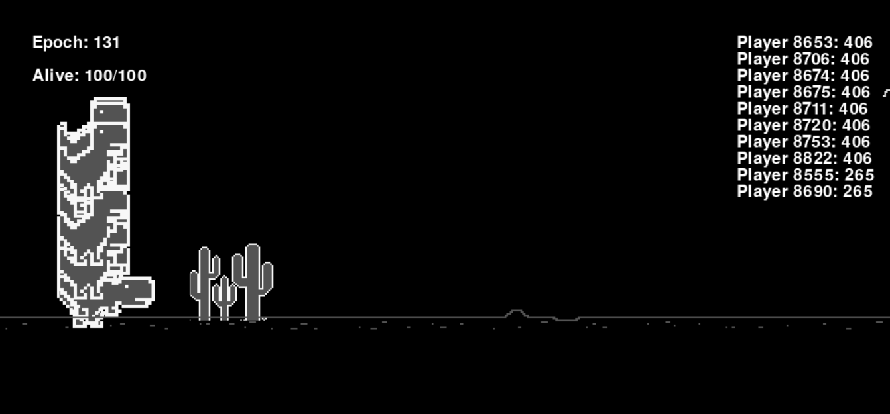
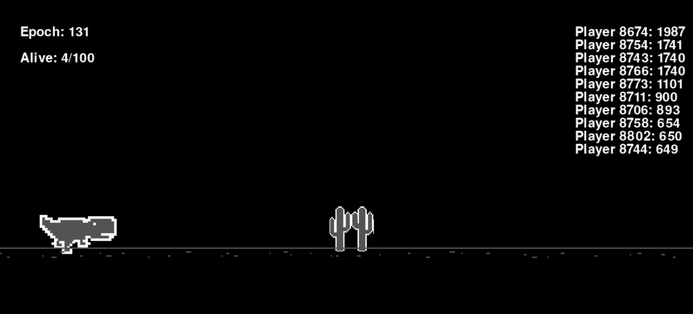

# 🚀 Dino AI - Treinamento com Algoritmo Genético

Um projeto que utiliza um Algoritmo Genético para treinar uma Rede Neural para jogar o clássico "jogo do dinossauro" do Chrome, implementado em Pygame.

## 🎯 Sobre o Projeto

Este sistema é baseado em três elementos principais:

* **1. O Jogo:** Implementado com `pygame`, o jogo reproduz o clássico dinossauro que deve pular ou se abaixar de obstáculos para continuar vivo.
* **2. Rede Neural:** Cada dinossauro controlado pela IA possui uma rede neural (`NeuralNetwork`) que recebe entradas do ambiente e decide automaticamente qual ação tomar.
* **3. Algoritmo Genético:** A evolução dos jogadores (`GeneticAlgorithm`) ocorre selecionando os melhores dinossauros a cada geração, realizando *crossover* e *mutação* para melhorar suas habilidades ao longo do tempo.

O objetivo é criar uma IA capaz de aprender a jogar o jogo do zero, melhorando seu desempenho a cada geração.

## 🕹️ IA em Ação

| População Inicial (100 Dinos) | Apenas 4 dinossauros restantes |
| :---: | :---: |
|  |  |

## ✨ Funcionalidades

* **Ambiente de Jogo:** Um clone funcional do jogo do dinossauro usando Pygame.
* **Controle por IA:** Os dinossauros tomam decisões (pular, abaixar, correr) com base na saída de sua própria rede neural.
* **Evolução Genética:** A população evolui automaticamente. Os dinossauros com melhor pontuação (que sobrevivem mais tempo) são selecionados para gerar a próxima geração.
* **Dashboard em Tempo Real:** Exibe a geração (epoch) atual, quantos dinossauros ainda estão vivos e o top 10 de pontuação.
* **Salvar/Continuar:** É possível salvar o estado atual da população (pesos das redes neurais) em um arquivo JSON e continuar o treinamento depois.

## 🤖 Como a IA Funciona

A IA começa com uma população inicial de dinossauros (ex: 100), cada um representado por uma rede neural com pesos e *bias* aleatórios.

### 1. A Rede Neural (O Cérebro)

Cada rede neural individual (`NeuralNetwork`) age como o cérebro de um dinossauro. Ela recebe 5 entradas do ambiente de jogo:

1.  `game_speed`: A velocidade atual do jogo.
2.  `y_obstacle`: A posição Y (altura) do obstáculo.
3.  `closest_obstacle.rect.x`: A distância X até o obstáculo.
4.  `closest_obstacle.rect.width`: A largura do obstáculo.
5.  `closest_obstacle.rect.height`: A altura do obstáculo.

Essas entradas passam por uma camada oculta (com função de ativação ReLU) e geram 3 saídas (com função Softmax):
1.  **Abaixar**
2.  **Correr**
3.  **Pular**

A ação com o maior valor de saída é a que o dinossauro executa.

### 2. O Algoritmo Genético (A Evolução)

Durante o jogo, os dinossauros que sobrevivem por mais tempo acumulam uma pontuação de *fitness* mais alta (baseada no tempo vivo).

Quando todos os jogadores morrem, o algoritmo genético (`GeneticAlgorithm`) entra em ação:
1.  **Seleção:** Os melhores indivíduos (com maiores pontuações) são selecionados.
2.  **Crossover:** Os pesos das redes neurais dos melhores "pais" são combinados para gerar "filhos", que herdam características de ambos.
3.  **Mutação:** Pequenas variações aleatórias são introduzidas nos pesos dos "filhos" para aumentar a diversidade genética e evitar que a IA fique presa em soluções subótimas.

Esse novo conjunto de "filhos" se torna a nova população para a próxima geração, e o processo se repete. O jogo continua por várias gerações até que os dinossauros aprendam a jogar de maneira eficiente.

## 🛠️ Tecnologias Utilizadas

* [Python](https://www.python.org/)
* [Pygame](https://www.pygame.org/news) (para o motor do jogo e visualização)
* [Numpy](https://numpy.org/) (para os cálculos matemáticos da rede neural)
